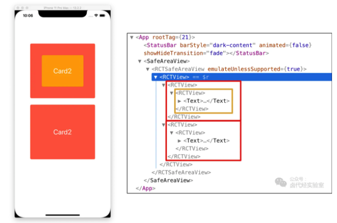
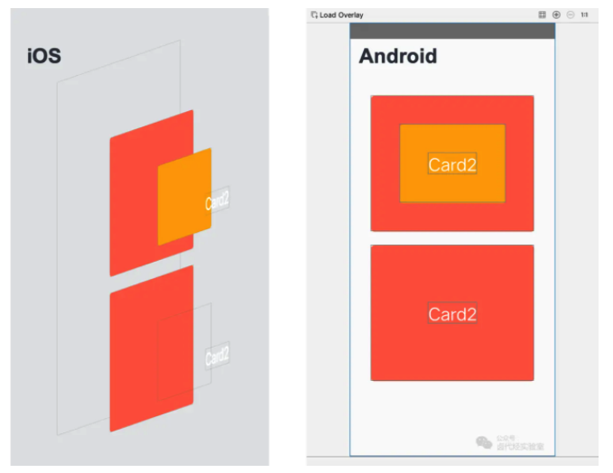

## 减轻渲染压力

React Native的布局底层依赖的Yoga这个跨平台布局库, 将虚拟DOM映射到原生布局节点的.在Web开发中,基本上都是一个虚拟DOM对应一个真实的DMO的,那么在React Native中是不是一一对应的关系?

只保留关键代码
```

// 以下示例 code 只保留了核心结构和样式，领会精神即可
render() {
  return (
    <View>
      <View style={{backgroundColor: 'orange'}}>
        <View style={{backgroundColor: 'yellow'}}>
          <Text>Card2</Text>
        </View>
      </View>
      <View style={{backgroundColor: 'orange'}}>
        <View>
          <Text>Card2</Text>
        </View>
      </View>
    </View>
  );
};

```
react-devtools查看React嵌套层级:


再看看渲染到原生后的嵌套层级


iOS是一个React节点对应一个原生View的节点,而Android第二个卡片的空白View不减了.


### 1️⃣使用React.Fragment避免多层嵌套

```

render() {
  return (
    <React.Fragment>
      <ChildA />
      <ChildB />
      <ChildC />
    </React.Fragment>
  );
}

// 或者使用 Fragment 短语法
render() {
  return (
    <>
      <ChildA />
      <ChildB />
      <ChildC />
    </>
  );
}

```
### 2️⃣减少GPU过度绘制

```
// 以下示例 code 只保留了核心结构和样式，领会精神即可
render() {
  return (
    <View>
      <View style={{backgroundColor: 'white'}}>
        <View style={{backgroundColor: 'white'}}>
          <Text style={{backgroundColor: 'white'}}>Card1</Text>
        </View>
      </View>
      <View>
        <View>
          <Text>Card2</Text>
        </View>
      </View>
    </View>
  );
};

```

- 减少背景色的重复设置
- 避免设置半透明颜色
- 避免设置圆角
- 避免设置阴影

